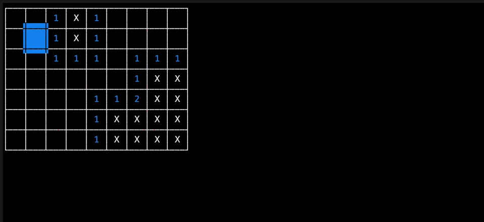

# Go minesweeper

> ## Basic implementation of minesweeper game in CLI built with golang

## Motivation

One day I couldn't sleep for some reasons. So, to clear out my boredom I decided to write basic random mines + counting mines for fun, Which did helped to sleep that night. Also I wanted to learn how to work with terminal UI & it was while since I wrote some go code. Well whole thing turns out to be a great experience.

## Requirements to run

> I'm not sure if old go version will work but you can try

- Go 1.16+

## How to run

- `go run \*.go`

## How to build

> Or you can download directly from tag section of github repository for your OS.
> If you download the binary from tags you have to chmod the binary `chmod 777 ./minesweeper-macos` or `chmod 777 ./minesweeper-linux` based on your os

- `go build -o minesweeper`
- `./minesweeper`

## Code architecture

> This is my first time writing small scale go project. So do let me know in issue if anything can be improved

- `constants.go` contains shared variables
- `engine.go` contains all raw logic to calculate bombs, grid & bomb counts
- `main.go` binds `engine` with `ui`
- `models.go` contains struct
- `ui.go` contains all logic to trigger/update ui based on data

## License

This project is licensed under the MIT license, Copyright (c) 2020 Hamza Iqbal. For more information see `LICENSE.md`.
